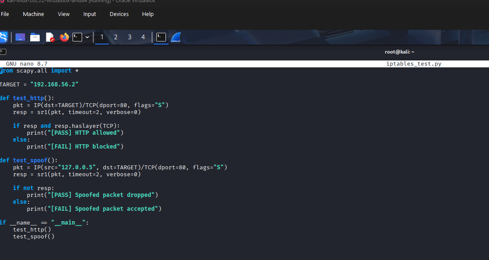
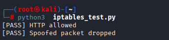
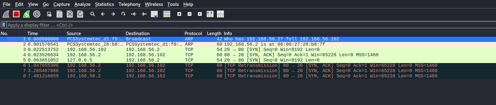

# 🔥 Firewall Validation Using Scapy

> A Python-based firewall validation framework using Scapy to craft and send raw packets, verifying firewall rule enforcement at the packet level.

---

## 📋 Table of Contents

- [Project Overview](#-project-overview)
- [Lab Environment](#-lab-environment)
- [Script Objective](#-script-objective)
- [Script Explanation](#-script-explanation)
- [Execution](#-execution)
- [Expected Output](#-expected-output)

---

## 📌 Project Overview

This project validates firewall behavior using crafted packets generated with **Scapy**.

**Objectives:**
- ✅ Verify allowed services (HTTP)
- ✅ Verify anti-spoofing protection
- ✅ Programmatically test firewall rule behavior
- ✅ Demonstrate understanding of packet-level inspection

> Tests were conducted from a **Kali Linux VM** against a firewall-controlled target system.

---

## 🖥️ Lab Environment

| Component | Details |
|-----------|---------|
| **Attacker Machine** | Kali Linux |
| **Virtualization** | VirtualBox |
| **Network Type** | Host-Only (`192.168.56.0/24`) |
| **Target IP** | `192.168.56.1` |
| **Firewall** | `iptables` / `pfSense` *(depending on test case)* |

---

## 🎯 Objective

The script performs **two validation tests**:

1. **HTTP Port Accessibility Test** — Confirms port 80 is open and accessible
2. **IP Spoofing Protection Test** — Confirms spoofed loopback packets are dropped

---
## 📜 Script

## 🧪 Execution 

##  Expected Output

## ⚠️ Disclaimer

> This project is intended for **educational and authorized lab use only**.  
> Do **not** run these tests against systems you do not own or have explicit permission to test.

---

