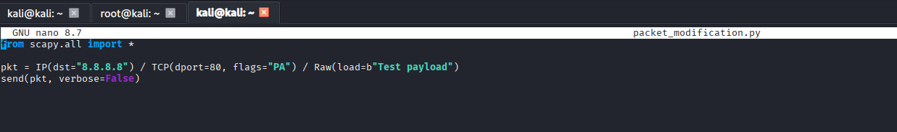
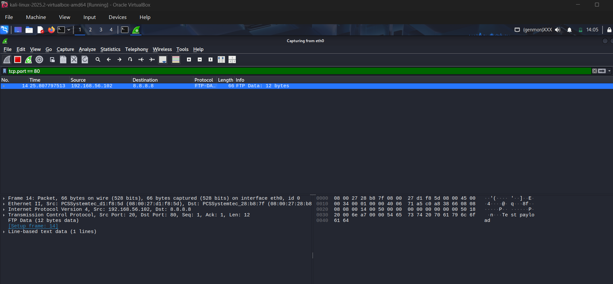

#🔍 Packet Modification using Scapy 

---
## 📌 Overview

This project demonstrates manual packet crafting and modification using Python and the Scapy library.
Custom TCP packets are created with modified headers and injected payloads, then transmitted on the network and verified using Wireshark.

⚠️ This project is strictly for educational and protocol-analysis purposes.
No exploitation, scanning, spoofing, or attack techniques are performed.

---

## 🛠️ Tools & Environment

Operating System: Kali Linux

Programming Language: Python 3

Library: Scapy

Packet Capture Tool: Wireshark

Network Interface: eth0

Execution Mode: Root privileges (sudo)

Destination IP: 8.8.8.8

Destination Port: 80 (HTTP)
---

## 🎯 Objective

Understand TCP packet structure

Craft custom IP and TCP headers manually

Inject custom payload data into TCP packets

Transmit crafted packets on the network

Verify packet contents using Wireshark

Observe how modified packets appear “on the wire”

---

## 📜 Script

---
## 🧪 Testing

## 📡 Packet Verification (Wireshark)

The transmitted packet was captured successfully on interface eth0.

Custom TCP payload data was visible in the packet capture.

IP, TCP, and payload layers appeared exactly as crafted in Scapy.

TTL, flags, and header fields confirmed correct packet transmission.

This confirms that packet modification and payload injection were successful.

---

## 🔐 Security Considerations

No spoofed source addresses were used.

No unauthorized targets were scanned.

Only a single destination IP was used for controlled testing.

The experiment focused on learning packet structure, not exploitation.

---

## 🧠 Learning Outcome

Through this project, the following concepts were reinforced:

Manual packet crafting with Scapy

TCP header and payload structure

Raw data injection into packets

Layer stacking in Scapy

Packet transmission vs packet capture

Verification of crafted packets using Wireshark

Ethical boundaries in packet manipulation experiments
