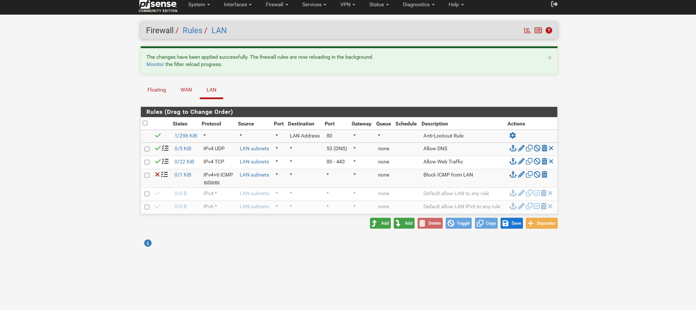

## Lab Environment

- Firewall: pfSense
- Client: Kali Linux (VirtualBox VM)
- Virtualization: VirtualBox
- Network Type: Host-Only Adapter (192.168.56.0/24)
- DNS Resolver: pfSense (192.168.56.2)

The Kali machine is placed behind pfSense on the LAN interface.
All outbound traffic is filtered using LAN rules.

## Firewall Design Strategy

The firewall follows these principles:

1. Explicit allow rules for required services
2. Explicit block rule for ICMP Echo Requests (learning purpose)
3. Reliance on pfSense's implicit deny for all other traffic
4. Minimal rule set to avoid over-engineering

⚠️ Note:
Blocking ICMP is done **for demonstration and learning only**.
In real production networks, selective ICMP is usually allowed for:
- MTU discovery
- Network diagnostics
- Monitoring

## Final LAN Firewall Rules (Order Matters)

1. **Anti-Lockout Rule**
   - Allows LAN access to pfSense Web GUI (port 80)
   - Prevents accidental admin lockout

2. **Allow DNS**
   - Protocol: IPv4 UDP
   - Destination Port: 53
   - Purpose: Permit DNS resolution via pfSense

3. **Allow Web Traffic**
   - Protocol: IPv4 TCP
   - Destination Ports: 80–443
   - Purpose: Allow HTTP and HTTPS traffic

4. **Block ICMP Echo Requests**
   - Protocol: IPv4 + IPv6 ICMP
   - ICMP Subtype: Echo Request
   - Purpose: Prevent ping-based reconnaissance

5. **Implicit Deny (pfSense default)**
   - Any traffic not matching above rules is blocked automatically
  

## 4️ Disabled Default Rules (Design Decision)

During the firewall configuration, pfSense automatically provides default rules such as:

- **Default allow LAN to any (IPv4)**
- **Default allow LAN IPv6 to any**

For this project, these default rules were **intentionally disabled** instead of deleted.

### Why I disabled them (not deleted):

- To **avoid broad “allow all” behavior** from the LAN
- To **force myself to explicitly define allowed traffic**
- To demonstrate understanding of **least-privilege firewall design**
- To keep default rules available for **rollback and troubleshooting**

Disabling the rules ensured that:
- No traffic is implicitly allowed just because it originates from the LAN
- Only traffic explicitly permitted by my custom rules is allowed
- The firewall behavior remains predictable and auditable

### Why this matters in a real environment:

In production environments:
- Default rules are often disabled during hardening
- Explicit allow rules improve visibility and security
- Disabled rules act as documentation of prior configurations

### Important note (Professional honesty):

I understand that in real enterprise environments:
- Default rules may be refined instead of fully disabled
- ICMP is often partially allowed for diagnostics
- IPv6 policies require careful planning

However, for this **learning and demonstration project**, disabling the default rules helped me:
- Understand rule order
- Understand implicit deny behavior
- Avoid accidental over-permissive access

## Testing & Verification

All testing was performed from the Kali Linux machine.

### DNS Test (Expected: PASS)
Command:
nslookup google.com

Result:
DNS resolution successful via pfSense (192.168.56.2)

---

### Web Traffic Test (Expected: PASS)
Command:
curl https://google.com

Result:
HTTP response received (301 redirect)
Web traffic allowed correctly

---

### ICMP Test (Expected: BLOCKED)
Command:
ping 8.8.8.8

Result:
100% packet loss

Interpretation:
ICMP Echo Requests are being dropped by the firewall.
This confirms the block rule is active and effective. 

## Key Mistakes & Lessons Learned

### Mistake 1: Blocking all ICMP subtypes
Initially, ICMP was blocked using "any" subtype.
This caused unexpected behavior and confusion during testing.

✔ Fix:
Only ICMP **Echo Request** was blocked.
This allowed better control and clearer results.

---

### Mistake 2: Confusing routing issues with firewall behavior
Messages like "Network is unreachable" were initially misinterpreted as firewall blocks.

✔ Fix:
Used routing table (`ip route`) and packet loss analysis.
Learned the difference between:
- Routing failure
- Firewall drop
- Protocol-specific blocking

---

### Mistake 3: VM network mode confusion
Host-Only Adapter behavior affected IPv6 and routing tests.

✔ Fix:
Clearly documented the lab limitation and focused on IPv4 testing.

